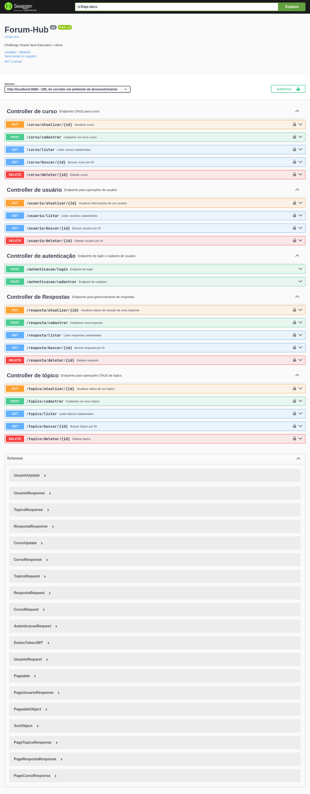
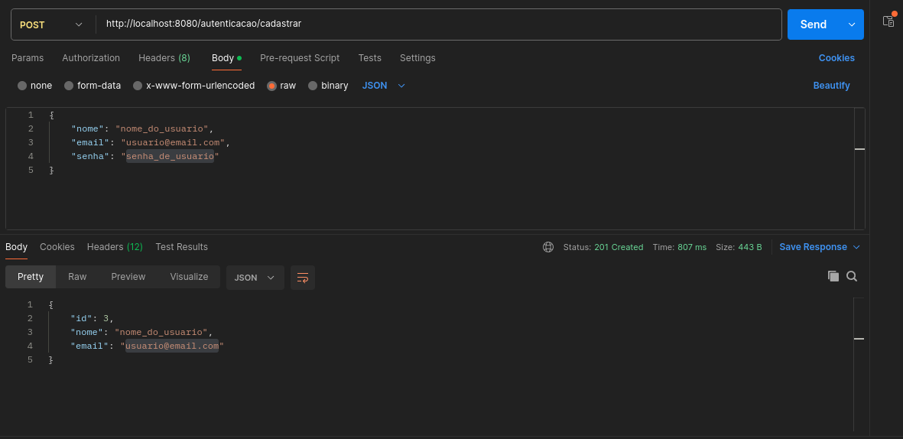
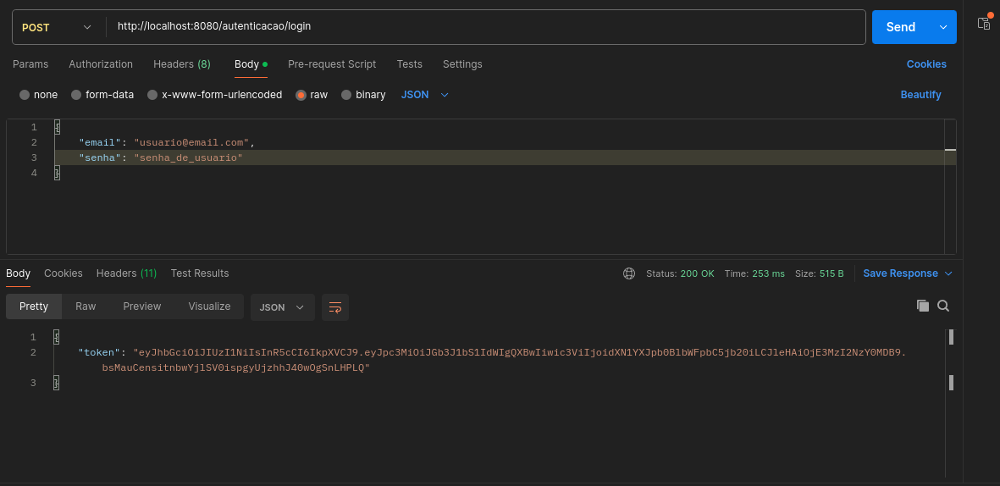

# Forum-Hub - Challenge ONE

## Oracle Next Education + Alura

## Descrição

A API forum-hub é uma plataforma para gerenciamento de tópicos e usuários em um fórum. Com funcionalidades que incluem cadastro, consulta, atualização e exclusão de tópicos e usuários, além de operações relacionadas a cursos e respostas, essa API permite que os usuários interajam de forma fluida e segura.

## Tecnologias Utilizadas

- **Java 17**
- **Spring Boot**
- **JWT**
- **MySQL**
- **Maven**
- **Docker**
- **Swagger**

## Entidades

- **Curso**: Representa os cursos associados aos tópicos do fórum.
- **Resposta**: Representa as respostas de usuários para tópicos específicos.
- **Tópico**: Representa os tópicos discutidos no fórum.
- **Usuário**: Representa os usuários registrados na plataforma.

## Infraestrutura

- **Documentação**: A API gera documentação automática utilizando SpringDoc(OpenAPI / Swagger).
- **GlobalHandler**: Para tratamento global de exceções e respostas de erro.
- **Segurança**: Implementação de segurança com JWT e Spring Security.

## Controllers

- **Autenticacao**: Login e cadastro
- **Curso**: Operações CRUD
- **Resposta**: Operações CRUD
- **Topico**: Operações CRUD
- **Usuario**: Operações CRUD

### Exemplos de Endpoints: 

| HTTP              | Rotas                  | Descrição                                       |
|-------------------|------------------------|-------------------------------------------------|
| <kbd>POST</kbd>   | /usuario/cadastrar     | Cadastrar um novo usuário.                      |
| <kbd>GET</kbd>    | /topico/listar         | Listar todos os tópicos do fórum com paginação. |
| <kbd>GET</kbd>    | /topico/buscar/{id}    | Buscar detalhes de um tópico específico.        |
| <kbd>PUT</kbd>    | /topico/atualizar/{id} | Atualizar o status de um tópico.                |
| <kbd>DELETE</kbd> | /topico/deletar/{id}   | Deletar um tópico existente.                    |

 
### Imagens

 

 

### Contruibuição

- Para contribuir, bifurque este repositório e envie suas alterações por meio de pull requests.
- Para relatórios de bugs ou sugestões de melhorias, abra um problema na página do projeto.